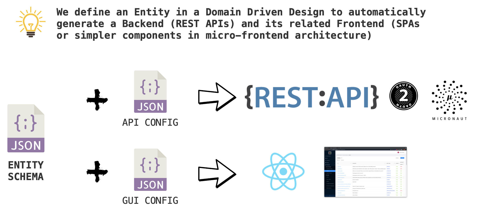
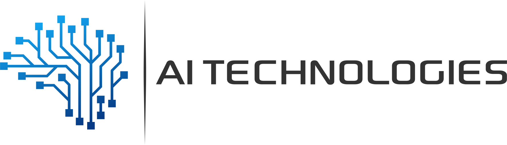

    <!---->
    
     
     
    <b>Cloud Native and Low Code Platform to create FullStack web Admin applications in minutes</b>
     
     

___

    

## ✨ Features & Technologies
- ***REST API generator***
    - Low Code CRUD & advanced filters/search APIs
    - Cloud Native and Serverless ready with Micronaut and GraalVM
    - Low code data storage drivers (define the schema and forget about anything else)
    - Customizable data drivers, for specific and custom use cases 
- ***Full React Admin Single Page Application***
    - Enterprise-class Antd architecture
    - Low Code ready to use Web App
    - Fully customizable with your own code and components
- ***Low code Full Stack React Components***
    - Enterprise-class Antd components (Tables, Forms, etc...)
    - Ready to use in your existing projects in minutes 

## 🏆 Top Use Cases
- Expose your data with solid REST APIs & OAuth2 without writing code
- Expose microservices data & boundaries
- Enterprise level BackOffice Web Application
    - For Internal usage (Admin Panels, Services Configuration, etc.)
    - For your clients, with ready to use full stack components
- Integrate full stack enterprise data components (tables, forms, etc..) in existing web applications
- Migration from Monolith to Cloud Native services and GUI

## 📄 Documentation

You can find the Gemini documentation on the [official website](https://gemini.at7.it).

Check out the [Getting Started](https://gemini.at7.it/getting-started) page for a quick overview.

**Attention!** Gemini is an under development platform. At the moment a full support service is guaranteed for companies who express interest
in the project. If you want to try it out or use it in your company you we could get in touch on [Linkedin](https://www.linkedin.com/in/andreatarquini/).

## ✨ Who is using

     
    
     

https://user-images.githubusercontent.com/13604122/141614137-ec3e379c-105a-4408-8402-a6f3dc3e531c.mp4

<!--- [AI Technologies](https://aitechnologies.it/) uses Gemini as an internal BackOffice:
- as a full Admin Panel to its Enterprise Virtual Assistant Platform services
- to perform atomic configuration releases between dev, staging and production environments
- to track Machine Learning experiments
- expose ML & Platform data with REST APIs */ -->

## ⚠️ Old Framework
In the last 2 year Gemini changed its architecture, from a Spring/Angular monolith approach to a Cloud Native and flexible one exploiting Micronaut and React. You can find the old framework on the [old-0.5.0 branch](https://github.com/gemini-projects/gemini/tree/old-0.5.0)

